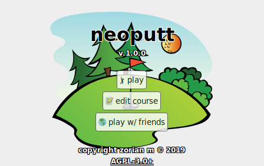
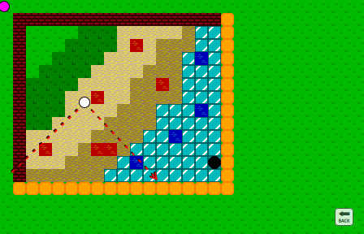
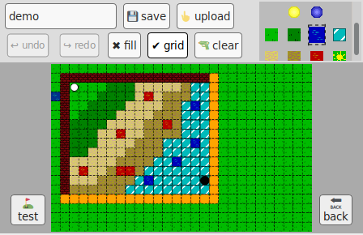
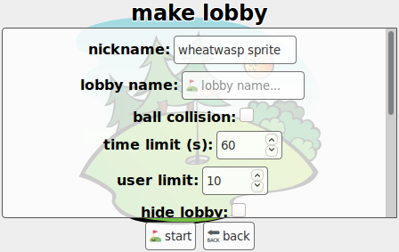

# neoputt
a web-based multiplayer minigolf simulator.

## screenshots

   

   

   

   

## installation

    $ npm install neoputt

    $ cd node_modules/neoputt

    $ npm run build

    $ npm start

## asset credits
any unlisted assets (files under `./img/` and `./sound/` directories) were
created by me and licensed under
[CC0](https://creativecommons.org/publicdomain/zero/1.0/legalcode).

* [`./img/acid.png` Sev - Splat](https://openclipart.org/detail/211412/splat) - CC0
* [`./img/brick.png` SpiderDave - Bricks](https://opengameart.org/content/bricks-tilable) - CC0
* [`./img/dark-sand.png` Sharm - Tiny 16: Basic](https://opengameart.org/content/tiny-16-basic) - CC-BY 3.0
* [`./img/grass.png` Sharm - Tiny 16: Basic](https://opengameart.org/content/tiny-16-basic) - CC-BY 3.0
* [`./img/sand.png` Sharm - Tiny 16: Basic](https://opengameart.org/content/tiny-16-basic) - CC-BY 3.0
* [`./sound/acid.ogg` bottles - Acid Burn](https://freesound.org/people/bottles/sounds/382313/) - CC0
* [`./sound/break.ogg` cejordi84 - Bricks.wav](https://freesound.org/people/cejordi84/sounds/232396/) - CC0
* [`./sound/bumper.ogg` plingativator - jawharp\_boing.wav](https://freesound.org/people/plingativator/sounds/188869/) - CC-BY 3.0
* [`./sound/crumple.ogg` j1987 - crumple.wav](https://freesound.org/people/j1987/sounds/106127/) - CC0
* [`./sound/drive.ogg` zolopher - Golf 1.wav](https://freesound.org/people/zolopher/sounds/75203/) - CC0
* [`./sound/hole.ogg` AGFX - Drop ball in cup-1.wav](https://freesound.org/people/AGFX/sounds/20428/) - CC-BY 3.0
* [`./sound/ice.ogg` o1sound - rockonice.wav](https://freesound.org/people/o1sound/sounds/137078/) - CC-BY 3.0
* [`./sound/lava.ogg` alienistcog - simmering-sauce.aif](https://freesound.org/people/alienistcog/sounds/124584/) - CC0
* [`./sound/magnet.ogg` Julien Nicolas - MAGNETIC](https://freesound.org/people/Julien%20Nicolas/sounds/133785/) - CC-BY 3.0
* [`./sound/putt.ogg` 170129 - putt.wav](https://freesound.org/people/170129/sounds/408260/) - CC0
* [`./sound/sand.ogg` mwmarsh - sand falling on paper.aiff](https://freesound.org/people/mwmarsh/sounds/85932/) - CC-Sampling+
* [`./sound/splash.ogg` kwahmah\_02 - Splash!](https://freesound.org/people/kwahmah_02/sounds/274254/) - CC-BY 3.0
* [`./sound/tap*.ogg` mkoenig - Golf Ball.wav](https://freesound.org/people/mkoenig/sounds/81172/) - CC-BY 3.0
* [`./sound/teleport.ogg` Sergenious - port.wav](https://freesound.org/people/Sergenious/sounds/55843/) - CC-BY 3.0

## license
Copyright (C) 2018  Zorian Medwid

This program is free software: you can redistribute it and/or modify
it under the terms of the GNU Affero General Public License as
published by the Free Software Foundation, either version 3 of the
License, or (at your option) any later version.

This program is distributed in the hope that it will be useful,
but WITHOUT ANY WARRANTY; without even the implied warranty of
MERCHANTABILITY or FITNESS FOR A PARTICULAR PURPOSE.  See the
GNU Affero General Public License for more details.

You should have received a copy of the GNU Affero General Public License
along with this program.  If not, see http://www.gnu.org/licenses/.
